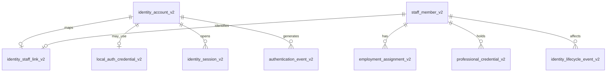

# Part 2 — Identity Architecture and Data Ownership

**Status:** TECHNICAL PACKAGE COMPLETE — SHADOW ONLY / AWAITING GOVERNANCE APPROVAL  
**Runtime effect:** None. The current `app_user`, `persona`, `staff_profile`, login API, and session flow remain active.  
**Blocking decisions:** `GOV-ID-01`, `GOV-ID-02`, `GOV-CLIN-02`, `GOV-AUD-01`

## 1. Objective

Part 2 separates authentication identity from the real staff record, employment, professional credentials, and clinical eligibility. It provides an additive SQLite reference schema, lifecycle rules, migration inventory, rollback plan, and executable acceptance tests.

It does not invent real employee numbers, verified email addresses, SSO subjects, or hospital approvals. Those values must come from their accountable owners.

## 2. Current-to-target mapping

| Current object | Current purpose | Target v2 object | Migration treatment |
|---|---|---|---|
| `persona` | Reusable system-user slot and display identity | `staff_member_v2` plus future immutable authorization subject | Preserve as legacy reference; do not reuse as a production person identifier |
| `app_user` | Username, local password, account status | `identity_account_v2` and `local_auth_credential_v2` | Link during shadow migration; do not copy raw session tokens |
| `app_session` | Raw bearer/cookie token | `identity_session_v2` | New sessions store only token hashes; old sessions expire or are revoked at cutover |
| `staff_profile` | Contact, employment-like fields, license fields | Staff Master reference, `employment_assignment_v2`, `professional_credential_v2` | Reconcile with HR/Credentialing before import; profile is not authoritative evidence |
| `staff_document` | Uploaded supporting documents | Existing document store referenced as evidence | Preserve; verification requires independent reviewer and evidence integrity controls |
| `registry_event` | General activity log | `identity_lifecycle_event_v2` and `authentication_event_v2` | Preserve legacy history; new events are append-only and structured |

## 3. Identity relationships

One account may exist without a staff link for tightly controlled technical/service identities. One staff member may have at most one interactive HNWMS account under the initial policy. Future multi-account needs require an explicit governance change.

## 4. Authoritative ownership

| Attribute | Source/owner | HNWMS rule |
|---|---|---|
| Employee number and employment status | HR Staff Master | Imported/reference data; not self-edited |
| Display/legal name | HR Staff Master | Self-service may request correction but cannot overwrite authority silently |
| Verified work email | Identity Provider / IT | Normalized and verified before use as login identifier |
| SSO external subject | Identity Provider / IT | Immutable provider binding; unique per provider |
| Home unit/position/FTE | HR + Nursing Administration | Effective-dated employment assignment |
| License number/status/expiry | Credentialing with authoritative evidence | Effective-dated credential; verifier and freshness recorded |
| Contact/notification preference | User subject to policy | Self-service allowed with audit |
| Account status and session revocation | IT/Security | Separate from employment and clinical eligibility |

## 5. Non-negotiable constraints

- Email is an attribute, never the primary key.
- Production staff identity is immutable and never a renamed job slot.
- Account, employment, credential, and eligibility states are separate.
- Disabling an account revokes sessions but does not rewrite employment history.
- Expired clinical credentials block affected clinical eligibility, not approved remediation access.
- Verified credentials require an independent verifier.
- SSO identities require an external subject; local credentials require an approved local-auth exception.
- Production sessions store a hash of the token, not the reusable token value.
- Lifecycle and authentication evidence is append-only.
- All timestamps are UTC and use a database-native timestamp in production; the SQLite reference uses validated ISO-8601 text.

## 6. Privacy classification

Employee numbers, contact details, national identifiers, professional credentials, uploaded documents, authentication events, and device/network context are sensitive. Part 2 stores only identity data required for its control purpose. National ID and full document contents are not copied into the v2 identity schema. Access, retention, encryption, masking, legal hold, export, and deletion rules remain subject to `GOV-AUD-01` and the hospital privacy policy.

