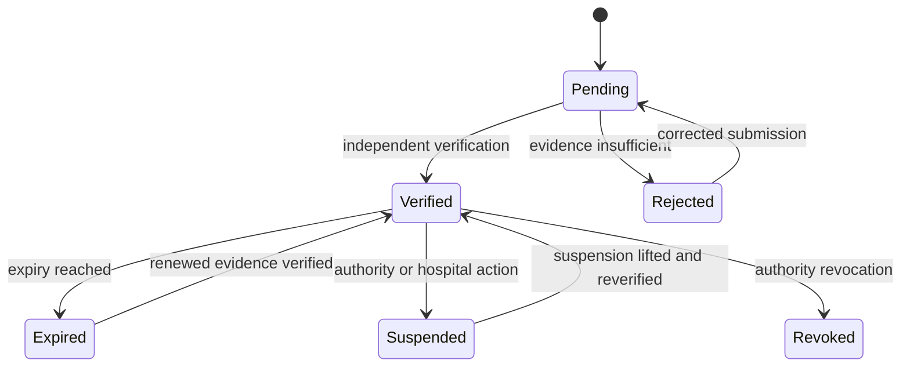

# Part 2 — Identity and User Lifecycle Workflows

## 1. Joiner

1. HR creates or updates the authoritative staff record.
2. Integration supplies immutable employee identifier, employment state, position, department/unit, and effective date.
3. HNWMS creates `staff_member_v2` and `employment_assignment_v2` in `PENDING` or `ACTIVE` state according to effective time.
4. IT/identity integration creates `identity_account_v2` using verified work email and immutable provider subject.
5. An authorized administrator links account and staff after deterministic match or documented manual reconciliation.
6. Roles/grants are handled in Part 3; account creation never implies clinical permission.
7. User completes first authentication and any required MFA enrollment.
8. Lifecycle events record every transition.

No identity is automatically activated from display-name matching.

## 2. Mover

1. HR provides a new effective-dated employment assignment.
2. Existing assignment history is closed; it is not overwritten.
3. Part 3 recalculates affected grants/scopes and queues approval/revocation.
4. Current sessions are reevaluated or revoked according to risk.
5. Unit-specific clinical access changes only at the approved effective time.
6. Reconciliation confirms no orphan unit grants remain.

## 3. Leaver

1. HR employment end triggers account review and immediate or scheduled disable according to policy.
2. Interactive sessions are revoked by incrementing `auth_version` and marking sessions revoked.
3. Active grants/delegations/elevations are revoked by their owning modules.
4. Evidence and decision history remain retained; identity records are archived, not reused.
5. Document access and export follow HR/privacy/legal policy.

## 4. Account lock, disable, and recovery

- `LOCKED` is normally temporary security protection.
- `DISABLED` prevents authentication and invalidates sessions.
- `ARCHIVED` represents a retained historical identity and cannot authenticate.
- Recovery requires verified identity, controlled reset/rebind, session revocation, and audit.
- Unlock/recovery by an administrator requires a different identity from the affected account.

## 5. Credential lifecycle

The scheduled expiry job supports alerts and state maintenance, but protected clinical transactions must use a current eligibility snapshot. A credential submitter cannot verify the same credential.

## 6. Identity mismatch and duplicate handling

Potential duplicate employee number, provider subject, verified email, or one-to-one account/staff linkage enters a reconciliation queue and blocks automatic activation. Resolution records the chosen records, evidence, reviewer, timestamp, and disposition of the non-selected record. Data is never merged solely by name similarity.

## 7. Recertification

- Verify account-to-person link on join, material identity change, and periodic review.
- Review privileged accounts monthly and all accounts at the approved cadence.
- Review service identity owner and purpose at least quarterly.
- Reconcile employment and account status daily where integration supports it.
- Escalate unresolved critical mismatches immediately; do not silently continue high-risk access.

