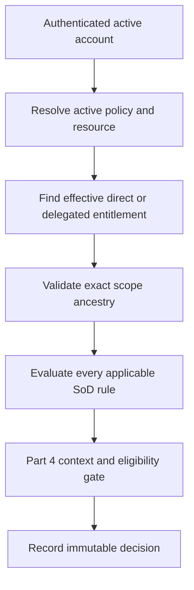

# Part 3 — Authorization Architecture and Decision Contract

**Status:** TECHNICAL PACKAGE COMPLETE — SHADOW ONLY / AWAITING GOVERNANCE APPROVAL
**Runtime effect:** None. The current `rbac/engine.py`, API, seed roles, and grants remain active.
**Blocking decisions:** `GOV-RBAC-01`, `GOV-RBAC-02`, `GOV-RBAC-03`, `GOV-SCOPE-01`; delegation also requires `GOV-DEL-01` and `GOV-DEL-02`.

## 1. Objective

Part 3 provides the authorization layer between the Part 2 identity model and the Part 4 clinical eligibility/guardrail layer. It replaces free-text scope assumptions, mutable role semantics, one-conflict SoD handling, and role-copy delegation with an additive, versioned reference implementation.

## 2. Decision sequence



Every missing, inactive, ambiguous, expired, revoked, or unknown input denies. A database or policy error returns `ERROR`, never implicit permission.

## 3. Part 3 decision formula

```text
PART3_ALLOW = account is ACTIVE
  AND requested policy version is ACTIVE
  AND permission exists in that policy
  AND resource resolves to one active facility hierarchy
  AND an effective ACTIVE direct grant or delegation contains the permission
  AND its validated scope contains the resource
  AND every applicable SoD rule returns PASS
```

Part 3 `ALLOW` is not final permission for a clinical transaction. Part 4 must additionally validate employment, shift/care context, credentials, competency, training, staffing/acuity guardrails, and approved emergency handling.

## 4. Stable decision response

| Field | Meaning |
|---|---|
| `decision_id` | Immutable unique decision identifier |
| `request_id` | Caller-supplied idempotency/correlation identifier |
| `decision` | `ALLOW`, `DENY`, or `ERROR` |
| `reason_code` | Stable machine-readable reason |
| `policy_version` | Exact evaluated policy |
| `matched_grant_id` | Source direct grant, including when delegation is used |
| `delegation_id` | Constrained delegation used, otherwise null |
| `sod_rule_ids` | Every applicable/evaluated conflict rule |
| `resource` | Resolved type, stable ID/code, and facility ancestry |
| `requires_part4` | True for protected actions requiring clinical/context checks |

`reason_detail` may support administrators but callers must branch only on the stable result and reason code.

## 5. Trust boundaries

- Applications do not infer permissions from titles, identity-provider groups, UI visibility, or employment position.
- Applications pass stable identity, permission, resource, policy, request, and context references to one authorization service or middleware.
- The database constrains structural integrity; the engine performs time-aware containment and all-conflict checks in one transaction snapshot.
- A prior `ALLOW` is not reusable for a later protected write. The decision must bind to the transaction/correlation ID and current policy state.
- Compliance exceptions and Part 4 break-glass are separate objects. Neither is represented as a permanent role or SoD waiver.

## 6. Failure behavior

Unknown account, permission, resource, policy version, scope, or delegation returns `DENY`. Unexpected engine/storage failure returns `ERROR`. Production treatment of `ERROR` is controlled by `GOV-BCP-01`; high-risk writes must not silently proceed.
