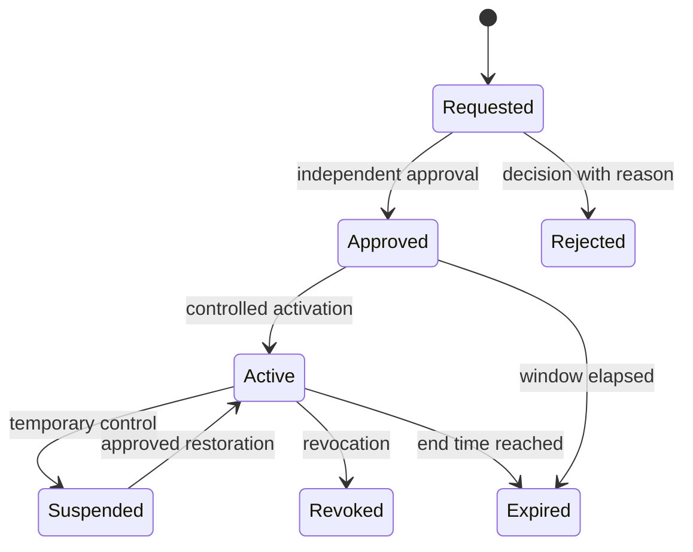

# Part 3 — Grant Lifecycle and Separation of Duties

## 1. Grant lifecycle

An access request contains one user, one versioned role, one validated scope, requested dates, reason, and justification. Active grants preserve requester, approver, activator, policy version, and source request. A grant never becomes active merely because a database row exists.

For a grant marked `requires_dual_control`, requester, approver, and activator must be separate according to approved policy. Self-approval is always prohibited. Revocation is immediate for evaluation purposes even if cleanup jobs have not rewritten status to `EXPIRED`.

## 2. Activation checks

Before activation, the service must verify in one transaction snapshot:

- account, role, policy, and scope are active;
- effective interval is valid;
- the approver is authorized and is not the requester/subject;
- dual-control separation is met where required;
- the complete resulting entitlement set has no blocking SoD conflict in overlapping scope;
- employment and eligibility prerequisites are queued for Part 4 where applicable;
- no superseding request, revocation, or policy retirement occurred.

Direct production editing of active grants is prohibited. State changes use controlled commands and append-only lifecycle evidence.

## 3. SoD representation

Each versioned rule has two atomic permissions, an overlap mode, enforcement points, severity, owner, and status. The initial reference engine supports `SAME_SCOPE_OR_CONTAINED` and `ANY_SCOPE`. Rules are canonicalized so the permission pair cannot be duplicated in reverse order.

At every decision, the engine evaluates all active rules for which the requested identity holds both permissions in a scope covering the target. It records every applicable rule—not only the first—and denies if any is `BLOCK`.

## 4. Required rules

The authoritative pending catalogue remains `../part-1-governance/03_sod_catalog.csv`. It includes:

- bed control versus roster publication;
- roster preparation versus final approval;
- credential submission versus verification;
- grant request versus grant approval;
- grant approval versus activation;
- exception request versus approval;
- delegation request versus approval;
- break-glass activation versus review;
- operational write versus audit administration;
- credential verification versus license-exception approval.

Some are entitlement conflicts; others are transaction-actor conflicts. The schema supports entitlement pairs, while each workflow must also enforce requester/approver/actor identity rules on its own transaction.

## 5. No standing waiver

`SYS_ADMIN`, another role name, or a comma-separated waiver list cannot bypass SoD. Part 4 may add an approved, finite, event-scoped authorization elevation. That event must be independently governed, MFA-bound, permission-specific, scope-specific, expiring, alerted, and reviewed. It cannot silently change a Part 3 rule or historical decision.

## 6. Recertification

- privileged grants: monthly;
- all grants: quarterly or approved cadence;
- JML reconciliation: daily where authoritative integration supports it;
- expiring grants and delegations: daily reconciliation plus decision-time enforcement;
- policy and SoD catalogue: quarterly and after material workflow change.

These are recommended defaults pending `GOV-REV-01` approval.
