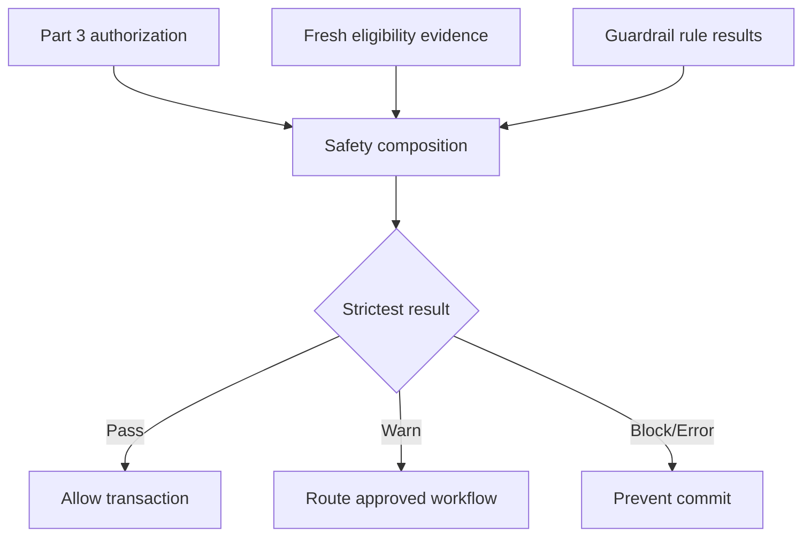

# Part 4 — Clinical Safety Architecture

**Status:** TECHNICAL PACKAGE COMPLETE — SHADOW ONLY / AWAITING GOVERNANCE APPROVAL
**Runtime effect:** None. No current endpoint, grant, clinical workflow, or compliance rule is changed.
**Blocking decisions:** `GOV-CLIN-01`, `GOV-CLIN-02`, `GOV-COMP-01`, `GOV-BG-01`, `GOV-BCP-01`; high decisions include `GOV-BG-02`, `GOV-BG-03`, and `GOV-AUD-01`.

## 1. Objective

Part 4 composes three independent questions immediately before a protected transaction commits:

1. **Authorization:** may this identity perform the operation in this scope?
2. **Clinical eligibility:** is this staff member currently qualified and authorized for the clinical context?
3. **Guardrail compliance:** would the proposed transaction satisfy the applicable labor, staffing, skill-mix, acuity, and hospital-policy rules?

An `ALLOW` from Part 3 is necessary but insufficient for a protected clinical write. It is accepted only within the safety policy's approved short decision-binding window. A previous safety result cannot be reused with a different transaction fingerprint.

## 2. Non-negotiable separation

- Account status, authorization, eligibility, and compliance are separate states.
- Break-glass can temporarily provide a predefined authorization permission. It cannot make an expired license valid or erase a guardrail result.
- A guardrail exception applies to one rule result and one transaction fingerprint. It does not grant RBAC permission.
- Some emergencies may require both an active break-glass event and a separately approved guardrail exception.
- Generic license exceptions are prohibited. Any exceptional licensure policy requires explicit multidisciplinary governance outside ordinary break-glass.

## 3. Strictest-result contract

`ERROR/BLOCK` prevents commit. `WARN` routes to the approved review/escalation workflow and is not silently converted to `ALLOW`. Only a fresh, transaction-bound set of passed or validly excepted results can produce final `ALLOW`.

## 4. Reuse of existing compliance model

The existing `compliance-guardrails/` package remains the rule-model authority. Part 4 does not create the rejected simplified `unit_compliance_rules` model or duplicate Staff Master data. Its adapter tables reference external rule codes/ruleset versions and store immutable evaluation evidence needed for composition and testing.

## 5. Decision evidence

Every safety decision records the Part 3 decision, staff, unit, permission, transaction fingerprint, eligibility snapshot, guardrail evaluation, effective exception references, break-glass event if used, exact policy versions, stable reason, and time. Evidence is append-only and privacy-minimized.
