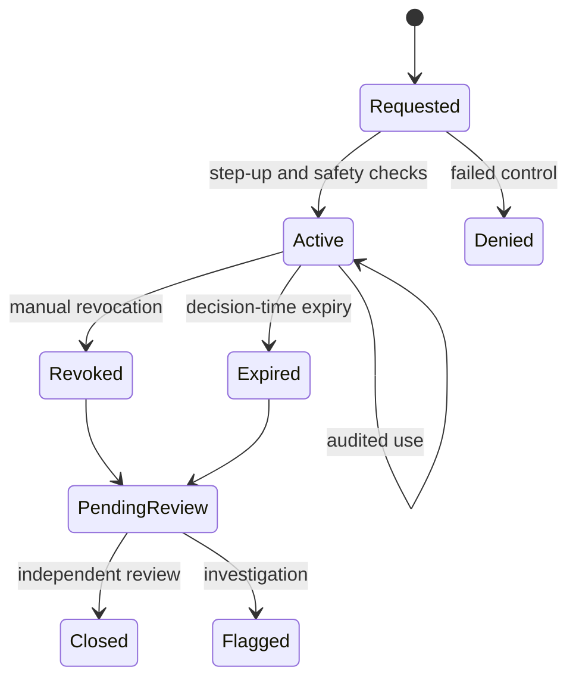

# Part 4 — Event-Scoped Break-Glass Controls

## 1. Purpose

Break-glass supports immediate patient-safety action when normal authorization cannot be obtained in time. It is not a convenience role, routine on-call grant, shared emergency account, permanent `SYS_ADMIN` waiver, or method for bypassing clinical eligibility/compliance.

## 2. Activation requirements

- active human account linked one-to-one to active staff;
- recent `STEP_UP` authentication from Part 2;
- qualified, fresh clinical eligibility for the target unit when the bundle is clinical;
- approved reason code and meaningful justification;
- exact validated Part 3 scope;
- predefined approved bundle and explicit permission list;
- duration no longer than the policy maximum or incident window;
- immediate notification to DON/on-call director, Risk/Quality, Security, and audit register;
- no identity, role/grant, policy, audit administration, credential verification, exception approval, or break-glass review permissions.

Service accounts and shared/demo identities cannot activate clinical break-glass.

## 3. Lifecycle

Every attempted use records the event ID, requested permission/scope, and resulting safety decision. Expiry removes only the elevation; it does not terminate the user's ordinary session.

## 4. Independent review

The activator cannot review or close their own event. Review is due within the approved SLA, recommended at 24 hours pending `GOV-BG-03`. Overdue review, repeated activation, prohibited permission attempts, or unexplained use creates an alert/case.

## 5. Composition examples

| Situation | Result |
|---|---|
| No normal grant, valid break-glass, valid eligibility, guardrails pass | May allow |
| Valid break-glass, expired license | Block |
| Valid break-glass, staffing rule blocks without separate approved exception | Block |
| Normal authorization missing, guardrail exception approved | Block |
| Both valid break-glass and exact approved guardrail exception | Evaluate remaining eligibility/rules; not automatic allow |

## 6. Governance status

The schema and tests are not authorization to activate break-glass. Eligible roles, bundles, maximum duration, reason codes, review SLA, alerts, BCP behavior, and clinical qualification requirements remain pending approval.
